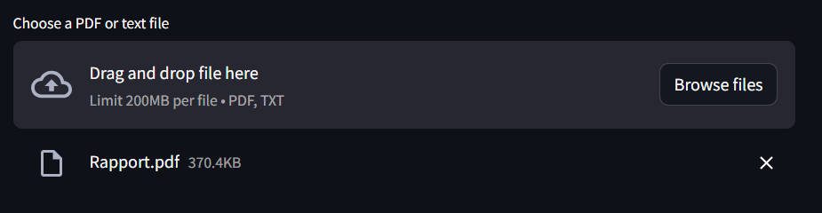
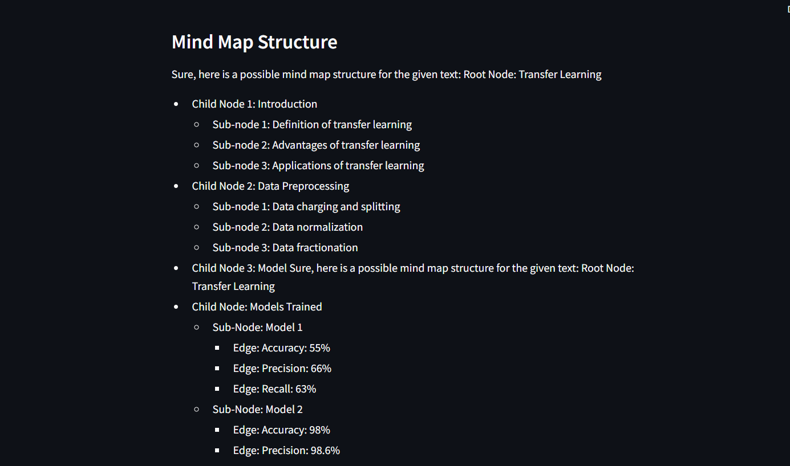
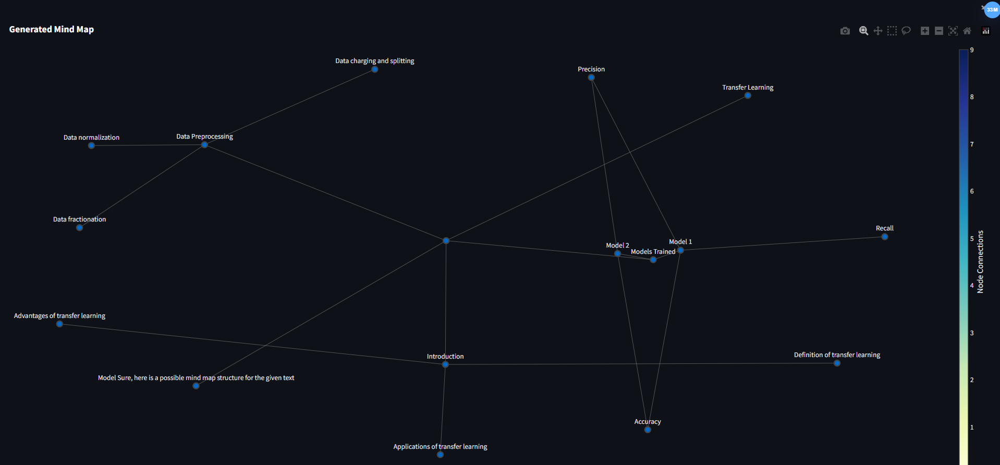
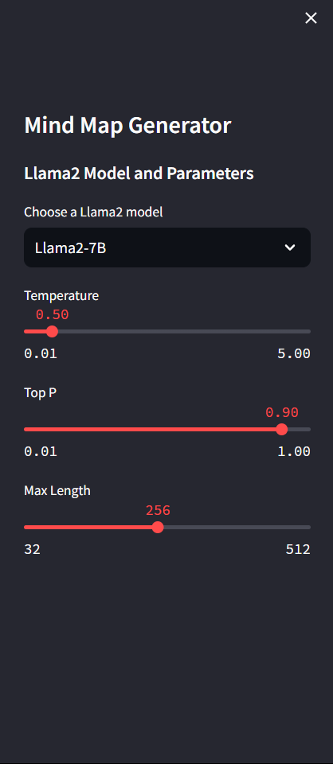

# Mind Map Generator

This project is a web application that generates mind maps from uploaded PDF or text files using the Llama2 language model. The application is built using Streamlit and several Python libraries for PDF processing, graph creation, and visualization.

## Features

- Upload PDF or text files
- Extract and process text to generate mind maps
- Visualize the generated mind maps interactively
- Adjust model parameters to customize the output

## Requirements

- Python 3.8 or higher
- Streamlit
- Replicate
- PyPDF2
- NetworkX
- Plotly

## Installation

1. Clone the repository:

    ```bash
    git clone https://github.com/your-username/mind-map-generator.git
    cd mind-map-generator
    ```

2. Create and activate a virtual environment (optional but recommended):

    ```bash
    python -m venv venv
    source venv/bin/activate  # On Windows use `venv\Scripts\activate`
    ```

3. Install the required packages:

    ```bash
    pip install -r requirements.txt
    ```

## Usage

1. Set your Replicate API token in the environment:

    ```bash
    export REPLICATE_API_TOKEN="your_replicate_api_token"
    ```

    On Windows, use:

    ```powershell
    set REPLICATE_API_TOKEN="your_replicate_api_token"
    ```

2. Run the Streamlit application:

    ```bash
    streamlit run app.py
    ```

3. Open your web browser and navigate to `http://localhost:8501` to use the application.

## How It Works

- **File Upload**: Upload a PDF or text file using the sidebar.

- **Text Extraction**: Extract text from the uploaded file. For PDFs, the text is extracted from each page.
- **Text Splitting**: Split the extracted text into manageable chunks.
- **Mind Map Generation**: Use the Llama2 model to generate a mind map structure based on the text chunks.

- **Mind Map Visualization**: Draw and display the generated mind map using NetworkX and Plotly.


## Playing with Parameters

The application allows you to adjust several parameters to customize the output of the Llama2 model:

- **Model Selection**: Choose between `Llama2-7B` and `Llama2-13B` models.
- **Temperature**: Adjust the temperature to control the randomness of the model's output. A higher temperature makes the output more random, while a lower temperature makes it more deterministic.
- **Top P**: Set the top-p value to use nucleus sampling. This parameter controls the cumulative probability for token selection.
- **Max Length**: Specify the maximum length of the generated response.

You can adjust these parameters using the sliders and dropdowns in the sidebar.



## Project Structure

- `app.py`: The main application script.
- `requirements.txt`: List of required Python packages.
- `README.md`: This file.

## Contributing

Contributions are welcome! Please fork the repository and create a pull request with your changes.

## License

This project is licensed under the MIT License. See the `LICENSE` file for more details.

## Acknowledgements

- [Streamlit](https://streamlit.io/)
- [Replicate](https://replicate.com/)
- [PyPDF2](https://pypdf2.readthedocs.io/)
- [NetworkX](https://networkx.github.io/)
- [Plotly](https://plotly.com/python/)
